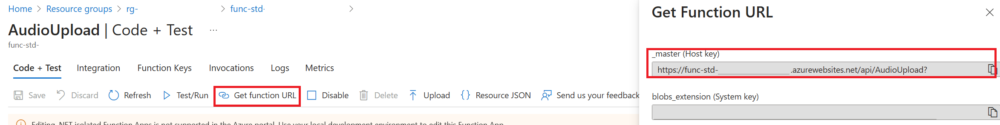
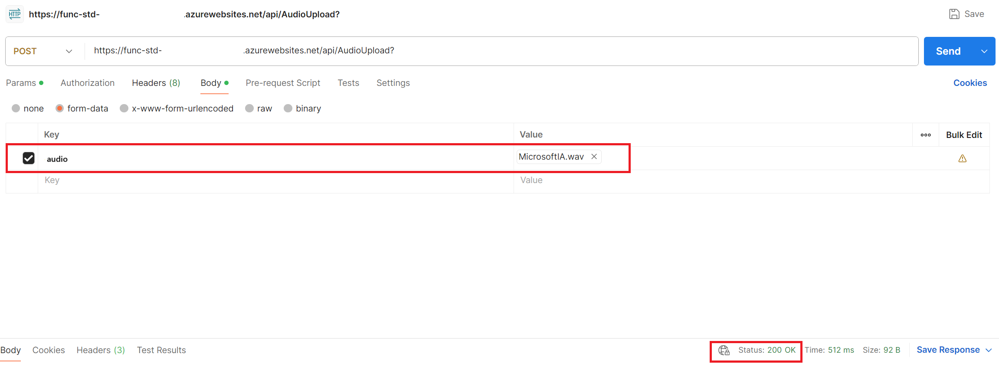

# Product Hands-on Lab - Azure Functions

Welcome to this Azure Functions Workshop. You'll be experimenting with Azure Functions service in multiple labs to achieve a real world scenario. Don't worry, even if the challenges will increase in difficulty, this is a step by step lab, you will be guided through the whole process.

During this workshop you will have the instructions to complete each steps. It is recommended to search for the answers in provided resources and links before looking at the solutions placed under the '📚 Toggle solution' panel.

<div class="task" data-title="Task">

> - You will find the instructions and expected configurations for each Lab step in these yellow **TASK** boxes.
> - Inputs and parameters to select will be defined, all the rest can remain as default as it has no impact on the scenario.
>
> - Log into your Azure subscription locally using Azure CLI and on the [Azure Portal][az-portal] using your own credentials.
> - Instructions and solutions will be given for the Azure CLI, but you can also use the Azure Portal if you prefer.

</div>


## Scenario

The goal of the full lab is to upload an audio file to Azure and save the transcripts back inside a Cosmos DB database. The scenario is as follows:


1. You will upload an [audio file](assets/whatstheweatherlike.wav) using a first Azure Function endpoint handling uploads will process the request 
1. The Azure Function will upload the file to a Storage Account
1. When the file is uploaded an Azure Durable Function will detect it and start processing it
1. The audio file is sent to Azure Cognitive Services via the Azure Durable Function. The speech to text cognitive service will process the file and return the result to the Azure Durable Function.
1. The Azure Durable Function will then store the transcript of the audio file in a Cosmos DB Database

You will also discover:
- How to setup a GitHub Actions workflow to deploy the Azure Functions.
- Use managed identity to secure the access to other Azure services.
- How to retrieve logs from the Azure Functions.
- Integrate the Azure Functions with API Management.

## Programming language

You will have to create few functions in this workshop to address our overall scenario. You can choose the programming language you are the most comfortable with among the ones [supported by Azure Functions][az-func-languages]. We will provide solutions in .NET 8 (isolated) for the moment, but other languages might be added in the future.

With everything ready let's start the lab 🚀

## Pre-requisites

Before starting this lab, be sure to set your Azure environment :

- An Azure Subscription with the **Owner** role to create and manage the labs' resources entirely and deploy the infrastructure as code. If not possible the **Contributor** role will be enough to deploy the resources but without the ability to create a Managed Identity.
- A dedicated resource group for this lab to ease the cleanup at the end.
- Register the Azure providers on your Azure Subscription if not done yet: `Microsoft.CognitiveServices`, `Microsoft.DocumentDB`, `Microsoft.ApiManagement`, `Microsoft.Web`, `Microsoft.LoadTestService`.


To retrieve the lab content :

- A Github account (Free, Team or Enterprise)
- Create a [fork][repo-fork] of the repository from the **main** branch to help you keep track of your changes

3 development options are available:
  - 🥇 **Preferred method** : Pre-configured GitHub Codespace 
  - 🥈 Local Devcontainer
  - 🥉 Local Dev Environment with all the prerequisites detailed below

<div class="tip" data-title="Tips">

> - To focus on the main purpose of the lab, we encourage the usage of devcontainers/codespace as they abstract the dev environment configuration, and avoid potential local dependencies conflict.
> 
> - You could decide to run everything without relying on a devcontainer : To do so, make sure you install all the prerequisites detailed below.

</div>

### 🥇 : Pre-configured GitHub Codespace

To use a Github Codespace, you will need :
- [A GitHub Account][github-account]

Github Codespace offers the ability to run a complete dev environment (Visual Studio Code, Extensions, Tools, Secure port forwarding etc.) on a dedicated virtual machine. 
The configuration for the environment is defined in the `.devcontainer` folder, making sure everyone gets to develop and practice on identical environments : No more conflict on dependencies or missing tools ! 

Every Github account (even the free ones) grants access to 120 vcpu hours per month, _**for free**_. A 2 vcpu dedicated environment is enough for the purpose of the lab, meaning you could run such environment for 60 hours a month at no cost!

To get your codespace ready for the labs, here are a few steps to execute : 
- After you forked the repo, click on `<> Code`, `Codespaces` tab and then click on the `+` button:


- You can also provision a beefier configuration by defining creation options and select the **Machine Type** you like: 


### 🥈 : Using a local Devcontainer

This repo comes with a Devcontainer configuration that will let you open a fully configured dev environment from your local Visual Studio Code, while still being completely isolated from the rest of your local machine configuration : No more dependancy conflict.
Here are the required tools to do so : 

- [Git client][git-client] 
- [Docker Desktop][docker-desktop] running
- [Visual Studio Code][vs-code] installed

Start by cloning the Hands-on-lab-Functions repo you just forked on your local Machine and open the local folder in Visual Studio Code.
Once you have cloned the repository locally, make sure Docker Desktop is up and running and open the cloned repository in Visual Studio Code.  

You will be prompted to open the project in a Dev Container. Click on `Reopen in Container`. 

If you are not prompted by Visual Studio Code, you can open the command palette (`Ctrl + Shift + P`) and search for `Reopen in Container` and select it: 


### 🥉 : Using your own local environment

The following tools and access will be necessary to run the lab in good conditions on a local environment :  

- [Git client][git-client] 
- [Visual Studio Code][vs-code] installed (you will use Dev Containers)
- [Azure CLI][az-cli-install] installed on your machine
- [Azure Functions Core Tools][az-func-core-tools] installed, this will be useful for creating the scaffold of your Azure Functions using command line.
- If you are using VS Code, you can also install the [Azure Function extension][azure-function-vs-code-extension]
- [.Net 8][download-dotnet] if you want to run all the Azure Functions solutions.

Once you have set up your local environment, you can clone the hands-on-lab-azure-functions repo you just forked on your machine, and open the local folder in Visual Studio Code and head to the next step. 

## Visual Studio Code Setup

### 👉 Load the Workspace

Once your environment is ready, you will have to enter the Visual Studio Workspace to get all the tools ready.
To do so, click the **burger menu** in the top left corner (visible only with codespace), **File** and then **Open Workspace from File...** 


- Select `.vscode/hands-on-lab-azure-functions.code-workspace` :


- You are now ready to go! For the rest of the lab, in case you lose the terminal, you can press `Ctrl + J` or open a new one here : 


Let's begin!

### 🔑 Sign in to Azure

<div class="task" data-title="Task">

> - Log into your Azure subscription in your environment using Azure CLI and on the [Azure Portal][az-portal] using your credentials.
> - Instructions and solutions will be given for the Azure CLI, but you can also use the Azure Portal if you prefer.

</div>

<details>

<summary>📚 Toggle solution</summary>

```bash
# Login to Azure : 
# --tenant : Optional | In case your Azure account has access to multiple tenants

# Option 1 : Local Environment or Dev Container
az login --tenant <yourtenantid or domain.com>
# Option 2 : Github Codespace : you might need to specify --use-device-code parameter to ease the az cli authentication process
az login --use-device-code --tenant <yourtenantid or domain.com>

# Display your account details
az account show
# Select your Azure subscription
az account set --subscription <subscription-id>

# Register the following Azure providers if they are not already

# Azure Cognitive Services
az provider register --namespace 'Microsoft.CognitiveServices'
# Azure CosmosDb
az provider register --namespace 'Microsoft.DocumentDB'
# Azure API Management
az provider register --namespace 'Microsoft.ApiManagement'
# Azure Functions
az provider register --namespace 'Microsoft.Web'
# Azure Load Test Service
az provider register --namespace 'Microsoft.LoadTestService'
```

</details>

### Access to Azure OpenAI

In the Lab 7 we will be using Azure OpenAI to analyse transcriptions.
Please make sure that you can deploy Azure OpenAI on your subscription if you want to do this lab.

TODO: find a reference/doc pointing to the model access form

### Deploy the infrastructure

You must deploy the infrastructure before starting the lab. 

First, you need to initialize the terraform infrastructure by running the following command:

```bash
cd terraform && terraform init
```

Then run the following command to deploy the infrastructure if you have the **Owner** role on the subscription:

```bash
terraform plan -out plan.out
```

If you have the **Contributor** role, you will need to set the `create_managed_identity` variable to `false` by running the following command:

```bash
terraform plan -var create_managed_identity=false -out plan.out
```

Finally apply the deployment:

```bash
# Apply the deployment directly
terraform apply -out plan.out
```

The deployment should take around 5 minutes to complete.

[az-cli-install]: https://learn.microsoft.com/en-us/cli/azure/install-azure-cli
[az-func-core-tools]: https://learn.microsoft.com/en-us/azure/azure-functions/functions-run-local?tabs=v4%2Clinux%2Ccsharp%2Cportal%2Cbash#install-the-azure-functions-core-tools
[az-func-languages]: https://learn.microsoft.com/en-us/azure/azure-functions/functions-versions#languages
[az-portal]: https://portal.azure.com
[vs-code]: https://code.visualstudio.com/
[azure-function-vs-code-extension]: https://marketplace.visualstudio.com/items?itemName=ms-azuretools.vscode-azurefunctions
[docker-desktop]: https://www.docker.com/products/docker-desktop/
[repo-fork]: https://github.com/microsoft/hands-on-lab-azure-functions/fork
[git-client]: https://git-scm.com/downloads
[github-account]: https://github.com/join
[download-dotnet]: https://dotnet.microsoft.com/en-us/download/dotnet/8.0

---

# Lab 1 : Upload an audio file

For this first lab, you will focus on the following scope :


The Azure Storage Account is used to store data objects, including blobs, file shares, queues, tables, and disks. You will use it to store the audios files inside an `audios` container.

To check that everything was created as expected, open the [Azure Portal][az-portal] and you should retrieve your `audios` container:


## Azure Functions : A bit of theory

Azure Functions is a `compute-on-demand` solution, offering a common function programming model for various languages. To use this serverless solution, no need to worry about deploying and maintaining infrastructures, Azure provides with the necessary up-to-date compute resources needed to keep your applications running. Focus on your code and let Azure Functions handle the rest.

Azure Functions are event-driven : They must be triggered by an event coming from a variety of sources. This model is based on a set of `triggers` and `bindings` which let you avoid hardcoding access to other services. Your function receives data (for example, the content of a queue message) in function parameters. You send data (for example, to create a queue message) by using the return value of the function :

- `Binding` to a function is a way of declaratively connecting another resource to the function; bindings may be connected as input bindings, output bindings, or both. Azure services such as Azure Storage blobs and queues, Service Bus queues, Event Hubs, and Cosmos DB provide data to the function as parameters.
- `Triggers` are a specific kind of binding that causes a function to run. A trigger defines how a function is invoked, and a function must have exactly one trigger. Triggers have associated data, which is often provided as a parameter payload to the function.

In the same `Function App` you will be able to add multiple `functions`, each with its own set of triggers and bindings. These triggers and bindings can benefit from existing `expressions`, which are parameter conventions easing the overall development experience. For example, you can use an expression to use the execution timestamp, or generate a unique `GUID` name for a file uploaded to a storage account.

Azure Functions run and benefit from the App Service platform, offering features like: deployment slots, continuous deployment, HTTPS support, hybrid connections and others. Apart from the `Consumption` (Serverless) model we're most interested in this Lab, Azure Functions can also be deployed a dedicated `App Service Plan`or in a hybrid model called `Premium Plan`.

## Azure Functions : Let's practice

At this stage in our scenario, the goal is to upload an audio into the Storage Account inside the `audios` container. To achieve this, an Azure Function will be used as an API to upload the audio file with a unique `GUID` name to your Storage Account.

<div class="task" data-title="Tasks">

> - Create an `Azure Function` with a POST `HTTP Trigger` and a `Blob Output Binding` to upload the file to the Storage Account. The Blob Output Binding will use a `binding expression` to generate a unique `GUID` name for the file.
>
> - Use the `func` CLI tool and .NET 8 using the isolated mode to create this Azure Function

</div>

<div class="tip" data-title="Tips">

> - [Azure Functions][azure-function]<br> 
> - [Azure Function Core Tools][azure-function-core-tools]<br> 
> - [Basics of Azure Functions][azure-function-basics]<br> 
> - [HTTP Triggered Azure Function][azure-function-http]<br>
> - [Blob Output Binding][azure-function-blob-output]<br> 
> - [Azure Functions Binding Expressions][azure-function-bindings-expression]

</div>

<details>
<summary>📚 Toggle solution</summary>

If necessary the source code with the solutions can be found in this Github Repository, under `./src/solutions/FuncStd`.

### Preparation

You will create a function using the [Azure Function Core Tools][azure-function-core-tools]:

```bash
# Create a folder for your function app and navigate to it
mkdir FuncStd
cd FuncStd

# Create the new function app as a .NET 8 Isolated project
# No need to specify a name, the folder name will be used by default
func init --worker-runtime dotnet-isolated --target-framework net8.0

# Create a new function endpoint with an HTTP trigger to which you'll be able to send the audio file
func new --name AudioUpload --template 'HTTP Trigger'

# Add a new Nuget package dependency to the Blob storage SDK
dotnet add package Microsoft.Azure.Functions.Worker.Extensions.Storage.Blobs --version 6.3.0

# Open the new projet inside VS Code
code .

```

If you open the Azure Function App resource started with `func-std` in the [Azure Portal][az-portal] and go to the `Environment variables` panel. You should see in App Settings the `STORAGE_ACCOUNT_CONTAINER` set to `audios` and the connection string of the storage account already pre-populated in the `STORAGE_ACCOUNT_CONNECTION_STRING` environment variable.

### .NET 8 implementation

In this version of the implementation, you will be using the [.NET 8 Isolated](https://learn.microsoft.com/en-us/azure/azure-functions/dotnet-isolated-in-process-differences) runtime.

Now that you have a skeleton for our `AudioUpload` function in the `AudioUpload.cs` file, you will need to update it to meet the following goals:

- It should read the uploaded file from the body of the POST request
- It should store the file as a blob inside the blob Storage Account
- It should respond to user with a status code 200

To upload the file, you will rely on the blob output binding [`BlobOutput`](https://learn.microsoft.com/en-us/azure/azure-functions/functions-bindings-storage-blob-output?tabs=python-v2%2Cin-process&pivots=programming-language-csharp) of the Azure Function, which will take care of the logic of connecting to the Storage Account and uploading the function with minimal line of code in our side.

To do this, let's start by adding a `AudioUploadOutput` class to the `AudioUpload.cs` file for simplicity but it can be done in a specific class.

```csharp
public class AudioUploadOutput
{
    [BlobOutput("%STORAGE_ACCOUNT_CONTAINER%/{rand-guid}.wav", Connection="STORAGE_ACCOUNT_CONNECTION_STRING")]
    public byte[] Blob { get; set; }

    public HttpResponseData HttpResponse { get; set; }
}
```

This class will handle uploading the blob and returning the HTTP response:

- The blob will be stored in the container identified by `STORAGE_ACCOUNT_CONTAINER` which is an environment variable.
- The blob will be named `{rand-guid}.wav` which resolves to a UUID followed by `.wav`.
- `STORAGE_ACCOUNT_CONNECTION_STRING` is the name of App setting which contains the connection string that you will use to connect to the blob storage account

Next, you will need to update the class `AudioUpload` to add the logic for reading the file from the request, and then use `AudioUploadOutput` to perform the blob upload and returning the response.

Update the code of the `Run` method in the `AudioUpload` class as follows:

```csharp
[Function(nameof(AudioUpload))]
public AudioUploadOutput Run(
    [HttpTrigger(AuthorizationLevel.Function, "post")] HttpRequestData req
)
{
    _logger.LogInformation("C# HTTP trigger function processed a request.");

    // Read the file contents from the request
    // and store it in the `audioFileData` buffer
    var audioFileData = default(byte[]);
    using (var memstream = new MemoryStream())
    {
        req.Body.CopyTo(memstream);
        audioFileData = memstream.ToArray();
    }

    // Prepare the response to return to the user
    var response = req.CreateResponse(HttpStatusCode.OK);
    response.Headers.Add("Content-Type", "text/plain; charset=utf-8");
    response.WriteString("Uploaded!");

    // Use AudioUploadOutput to return the response and store the blob
    return new AudioUploadOutput()
    {
        Blob = audioFileData,
        HttpResponse = response
    };
}
```

</details>

### Testing

#### Run the function locally

Add the following environment variables to your `local.settings.json` file:

```json
{
  "IsEncrypted": false,
  "Values": {
    "AzureWebJobsStorage": "UseDevelopmentStorage=true",
    "FUNCTIONS_WORKER_RUNTIME": "dotnet-isolated",
    "STORAGE_ACCOUNT_CONNECTION_STRING": "<your-storage-account-connection-string>",
    "STORAGE_ACCOUNT_CONTAINER": "audios"
  }
}
```

To test your function locally, you will need to start the extension `Azurite` to emulate the Azure Storage Account. Just run `Ctrl` + `Shift` + `P` and search for `Azurite: Start`:


Then you can use the Azure Function Core Tools to run the function locally:

```bash
func start
```

<div class="tip" data-title="Tips">

> - If you are using Github Codespaces for testing and you encounter authentication issues (e.g. 401) then first make sure the visiblity of the port `7071` is either set to "Public" or that you are passing a valid Github token in the `X-Github-Token` header.
> - Please refer to this [port forwarding guide on Github Codespaces](https://docs.github.com/en/codespaces/developing-in-a-codespace/forwarding-ports-in-your-codespace#using-command-line-tools-and-rest-clients-to-access-ports) for more details.

</div>


### Deployment

#### Option 1 : Deploy your function with VS Code

- Open the Azure extension in VS Code left panel
- Make sure you're signed in to your Azure account
- Open the Function App panel
- Right-click on your function app and select `Deploy to Function App...`


#### Option 2 : Deploy your function with the Azure Function Core Tools

Deploy your function using the VS Code extension or by command line:

```bash
# Inside the FuncStd folder run the following command:
func azure functionapp publish func-std-<your-instance-suffix-name>
```

Let's give a try using Postman. Go to the Azure Function and select `Functions` then `AudioUpload` and select the `Get Function Url` with the `default (function key)`. 
The Azure Function url is protected by a code to ensure a basic security layer. 



Use this url into your Postman to upload the audio file. Create a POST request and in the row where you set the key to `audios` make sure to select the file option in the hidden dropdown menu to be able to select a file in the value field:



</details>

### Save your changes

Don't forget to commit your changes to your forked repository to keep track of your progress. You will need the code for the next labs.

You can commit directly on the `main` branch for this workshop:

Open a terminal and run the following commands:

```bash
# Add, commit and push your changes
git add .
git commit -m "Lab 1 - Azure Function to upload audio file"
git push
```

You are now ready for the next labs!

## Lab 1 : Summary

By now you should have a solution that :

- Send new audio files added to a blob storage using a first Azure Function, inside an `audios` container.

The first Azure Function API created in the Lab offers a first security layer to the solution as it requires a key to be called, as well as makes sure all the files are stores with a uniquely generated name (GUID).

[az-portal]: https://portal.azure.com
[azure-function]: https://learn.microsoft.com/en-us/cli/azure/functionapp?view=azure-cli-latest
[azure-function-core-tools]: https://learn.microsoft.com/en-us/azure/azure-functions/functions-run-local?tabs=v4%2Cwindows%2Ccsharp%2Cportal%2Cbash
[azure-function-basics]: https://learn.microsoft.com/en-us/azure/azure-functions/supported-languages
[azure-function-http]: https://learn.microsoft.com/en-us/azure/azure-functions/functions-bindings-http-webhook-trigger?pivots=programming-language-python&tabs=python-v2%2Cin-process%2Cfunctionsv2
[azure-function-blob-output]: https://learn.microsoft.com/en-us/azure/azure-functions/functions-bindings-storage-blob-output?pivots=programming-language-python&tabs=python-v2%2Cin-process
[azure-function-bindings-expression]: https://learn.microsoft.com/en-us/azure/azure-functions/functions-bindings-expressions-patterns

---

# Lab 2 : Deploy your Azure Functions using GitHub Actions

In this lab you will use the `FuncStd` Function App created in the previous lab.

The goal is to automate the deployment of this Function App usin  GitHub Actions. This will allow you to deploy all new changes to Azure when you push your code to the repository.

## Create a GitHub Actions workflow

<div class="task" data-title="Tasks">

> - Inside the Azure Function App on Azure Portal which start by `func-std`, go to the `Deployment Center` and try to setup a GitHub Actions workflow to deploy the Azure Functions from the `FuncStd` folder.

</div>

<div class="tip" data-title="Tips">

> - [Azure Functions Deployment Center][azure-function-deployment-center]<br>

</div>


<details>
<summary>📚 Toggle solution</summary>

### Configure the deployment source

Go to the Azure Function App resource with the name starting with `func-std` in the [Azure Portal][az-portal] and go to the `Deployment Center`:


In the dropdown menu, select `GitHub`. You will have to sign in to your GitHub account and select the repository and branch you want to deploy from, in your case it should be the forked repository of this workshop and the `main` branch:


Then if you have deployed the infrastructure using the provided Terraform configuration with the **Owner** role on your subscription select the `User-assigned Identity` option to manage the authentication between GitHub and Azure. 

You should see an identity stating with `id-func-std-` in the resource group of the Function App. Select this identity in the dropdown menu:


If you have deployed the infrastructure with the **Contributor** role, select the `Basic authentication` option. This will use the Publish Profile to authenticate the deployment.

Azure will generate for you a new workflow based on the configuration of your Function App and push it directly to your GitHub repository inside the `.github/workflows` folder. You have also access to a preview of the workflow at the end of the process by clicking on `Preview file`.

Finally, click on the **Save** button and let Azure processed the creation of the workflow.

### Update the GitHub Actions workflow

Now if you go to your GitHub repository, you should see a new folder `.github` with a `workflows` folder containing the `YAML` file. The file which should start with: `main_func-std-`.

Open it and update the `AZURE_FUNCTIONAPP_PACKAGE_PATH` value with the folder where your Function App is located. In this case, if you followed the previous lab entirely, it should be `FuncStd`.

Your workflow file should look like this one:

```yaml
name: Build and deploy dotnet core project to Azure Function App

on:
  push:
    branches:
      - main
  workflow_dispatch:

env:
  AZURE_FUNCTIONAPP_PACKAGE_PATH: 'FuncStd' # set this to the path to your web app project, defaults to the repository root
  DOTNET_VERSION: '8.0.x' # set this to the dotnet version to use

jobs:
  build-and-deploy:
    runs-on: ubuntu-latest
    permissions:
      id-token: write #This is required for requesting the JWT

    steps:
      - name: 'Checkout GitHub Action'
        uses: actions/checkout@v4

      - name: Setup DotNet ${{ env.DOTNET_VERSION }} Environment
        uses: actions/setup-dotnet@v1
        with:
          dotnet-version: ${{ env.DOTNET_VERSION }}

      - name: 'Resolve Project Dependencies Using Dotnet'
        shell: bash
        run: |
          pushd './${{ env.AZURE_FUNCTIONAPP_PACKAGE_PATH }}'
          dotnet build --configuration Release --output ./output
          popd
      
      - name: Login to Azure
        uses: azure/login@v1
        with:
          client-id: ${{ secrets.AZUREAPPSERVICE_CLIENTID_AF92B6192C8247AEB1477BD6F8234F8 }}
          tenant-id: ${{ secrets.AZUREAPPSERVICE_TENANTID_5D6C9612393042E18C71D6C1E815AD8 }}
          subscription-id: ${{ secrets.AZUREAPPSERVICE_SUBSCRIPTIONID_9D0D44BA36384A2886F3894D5296BBD }}

      - name: 'Run Azure Functions Action'
        uses: Azure/functions-action@v1
        id: fa
        with:
          app-name: 'func-std-lab-ea-hol-ms-548d-01'
          slot-name: 'Production'
          package: '${{ env.AZURE_FUNCTIONAPP_PACKAGE_PATH }}/output'
```

Now you can push this file to your repository and the GitHub Actions workflow will be triggered to deploy the Azure Function App.

Let's understand how this GitHub Action workflow works:

- The `on` section defines the events that will trigger the workflow. In this case, the workflow will be triggered on every push to the `main` branch but also manually using the `workflow_dispatch` event.

- The `env` section defines the environment variables that will be used in the workflow. The `AZURE_FUNCTIONAPP_PACKAGE_PATH` variable is set to the path of the Azure Function App project and the `DOTNET_VERSION` variable is set to the version of the .NET SDK to use.

- Then you have a job called `build-and-deploy` that runs on an `ubuntu-latest` runner. This job has several steps:
  - The first step checks out the code from the repository.
  - The second step sets up the .NET environment using the `setup-dotnet` action.
  - The third step resolves the project dependencies using the `dotnet build` command.
  - The fourth step logs in to Azure using the `azure/login` action with the user assigned identity to connect to Azure. All the credentials are stored in GitHub secrets. If you have deployed the infrastructure with the **Contributor** role, the `azure/login` will not be used and the `functions-action` will use the Publish Profile to authenticate the deployment.
  - The final step runs the Azure `functions-action` to deploy the Azure Function App.

To see the deployment status, go to the `Actions` tab in your GitHub repository:


If you open it you will see the detail of the job with all the steps executed:


As you can see all steps executed successfully and you can look at the logs to see the details of each step.

You can now try to add some changes to your Azure Function and push them to your repository to see the GitHub Actions workflow in action.

</details>

## Lab 2 : Summary

By now you should have a solution that deploy the Azure Function App using GitHub Actions.

[azure-function-deployment-center]: https://learn.microsoft.com/en-us/azure/app-service/deploy-continuous-deployment?tabs=github%2Cgithubactions#configure-the-deployment-source
[az-portal]: https://portal.azure.com

---

# Lab 3 : Secure your Azure Functions with Managed Identity

In the previous labs, you have created an Azure Function App and deployed it using GitHub Actions. 

In the first lab, you have created an Azure Function to upload an audio file to a Storage Account, but you have used a connection string to access the Storage Account. This is not the best practice as the connection string is a sensitive information.

Using managed identities in Azure offers several key benefits:

- **Enhanced Security**: Managed identities eliminate the need to store credentials in your code, reducing the risk of accidental leaks or breaches.
- **Simplified Credential Management**: Azure automatically handles the lifecycle of these identities, so you don’t need to manually manage secrets, passwords, or keys.
- **Seamless Integration**: Managed identities can authenticate to any Azure service that supports Microsoft Entra ID authentication, making it easier to connect and secure your applications.
- **Cost Efficiency**: There are no additional charges for using managed identities, making it a cost-effective solution for securing your Azure resources.

In this lab, you will update your Azure Function to secure the access to the Azure Storage Account using a Managed Identity.

## Use a Managed Identity

<div class="task" data-title="Tasks">

> - Assign the role of `Storage Blob Data Owner` to your Azure Function app identity.
> - Update the `Connection` parameter of the `AudioUploadOutput` class to `AudioUploadStorage`
> - Setup the environment variables in the Azure Function App to use the Managed Identity to access the Storage Account.

</div>

<div class="tip" data-title="Tips">

> - [Azure Managed Identity setup][azure-managed-identity]<br>

</div>

<details>
<summary>📚 Toggle solution</summary>

### Update the Blob Output Binding

In your `AudioUpload.cs` file, you will need to update the `BlobOutput` attribute of the `AudioUploadOutput` class to use the `AudioUploadStorage` connection.

This name will be then concatenated with the `__serviceUri` environment variable to create the full URI of the Storage Account where you have uploaded your files, so the managed identity can access it.

Redeploy your Azure Function App using GitHub Actions or manually.

### Assign the role to the Managed Identity

In the Storage Account resource where you have uploaded your audio file previously, go to the `Access control (IAM)` tab and click on `+ Add` and then `Add role assignment` button.

In the **Role** tab select `Storage Blob Data Owner`, then in the **Members** tab select **Managed Identity** for the name of your Azure Function App and select it:


Finally click on the **Review + assign** button.

### Update environment variables

In the Azure Function App resource with the name starting with `func-std`, go to the **Settings** tab and **Environment variables**, in the **App settings** tab, add a new environment variable with the name `AudioUploadStorage__serviceUri` and set the value to:

```sh
https://YOUR_STORAGE_ACCOUNT_NAME.blob.core.windows.net
```

Of course, make sure to replace `YOUR_STORAGE_ACCOUNT_NAME` with the name of your storage account:


Finally, remove the old `STORAGE_ACCOUNT_CONNECTION_STRING` environment variable so that the Azure Function App will use the Managed Identity to access the Storage Account.

Try to upload a new audio file using Postman to make sure that the Managed Identity is working correctly.

</details>

## Lab 3 : Summary

In this lab you have secured the access to the Azure Storage Account using a Managed Identity. Now you don't need to worry about storing the connection string in your Azure Function App, the Managed Identity will take care of the authentication.

[azure-managed-identity]: https://learn.microsoft.com/en-us/azure/azure-functions/functions-bindings-storage-blob-output?tabs=python-v2%2Cisolated-process%2Cnodejs-v4&pivots=programming-language-csharp#identity-based-connections

---

# Lab 4 : Process the audio file with an Azure Durable Function
 
To process the audio file, extract the transcript and save it to Azure Cosmos DB, you will need to create a Durable Function. Durable Functions are an extension of Azure Functions that lets you write stateful functions in a serverless environment. The extension manages state, checkpoints, and restarts for you.

For this lab, you will focus on the following scope :


## Detect a file upload event 

Now you have the audio file uploaded in the storage account, you will need to detect this event to trigger the next steps of the scenario.

<div class="task" data-title="Tasks">

> - Create a new `Durable Function` with a `Blob Trigger` to detect the file upload event and start the processing of the audio file.
>
> - Use the `func` CLI tool and .NET 8 using the isolated mode to create this Durable Function.
> - Use the `Audio.cs` file below to instanciate an `AudioFile` object when the Azure Function is triggered.
> - Create an `AudioTranscriptionOrchestration.cs` file which will be used to create the orchestration of the entire Azure Function.
> - Generate a uri with a SAS token to access the blob storage.

</div>

<div class="tip" data-title="Tips">

> - [Azure Functions][azure-function]<br>
> - [Azure Functions Binding Expressions][azure-function-bindings-expression]<br>
> - [Azure Function Blob Triggered][azure-function-blob-trigger]<br>

</div>

The `Audio.cs` file will be used to create an `AudioFile` object and also an `AudioTranscription` object when the transcription is done, this will be used to store the data in Cosmos DB in the next step.

```csharp
// Audio.cs
using System.Text.Json.Serialization;

namespace YOUR_NAMESPACE_HERE
{
    public abstract class Audio
    {
        [JsonPropertyName("id")]
        public string Id { get; set; }
        
        // Blob path uri
        [JsonPropertyName("path")]
        public string Path { get; set; }
    }

    public class AudioFile : Audio
    {
        [JsonPropertyName("urlWithSasToken")]
        public string UrlWithSasToken { get; set; }

        [JsonPropertyName("jobUri")]
        public string? JobUri { get; set; }
    }

    public class AudioTranscription : Audio
    {
        [JsonPropertyName("result")]
        public string Result { get; set; }

        [JsonPropertyName("status")]
        public string Status { get; set; }
    }
}
```

<details>
<summary>📚 Toggle solution</summary>

```bash
# Create a folder for your function app and navigate to it
mkdir <function-app-name>
cd <function-app-name>

# Create the new function app as a .NET 8 Isolated project
# No need to specify a name, the folder name will be used by default
func init --worker-runtime dotnetIsolated --target-framework net8.0

# Add the Nuget package for Storage Account to use for Functions
dotnet add package Microsoft.Azure.Functions.Worker.Extensions.Storage.Blobs --version 6.3.0

# Add the Nuget package to use Durable Functions
dotnet add package Microsoft.Azure.Functions.Worker.Extensions.DurableTask --version 1.0.0

# Open the new projet inside VS Code
code .
```

Add the `Audio.cs` file with the content provided above. Then create a new file called `AudioTranscriptionOrchestration.cs` to create the orchestration of the entire Azure Function.

First, let's create the Blob Trigger function:

```csharp
using Microsoft.Azure.Functions.Worker;
using Microsoft.DurableTask;
using Microsoft.DurableTask.Client;
using Microsoft.Extensions.Logging;
using Azure.Storage.Blobs;
using Azure.Storage.Sas;

namespace YOUR_NAMESPACE_HERE
{
    public static class AudioTranscriptionOrchestration
    {
        [Function(nameof(AudioBlobUploadStart))]
        public static async Task AudioBlobUploadStart(
                [BlobTrigger("%STORAGE_ACCOUNT_CONTAINER%/{name}", Connection = "STORAGE_ACCOUNT_CONNECTION_STRING")] BlobClient blobClient,
                [DurableClient] DurableTaskClient client,
                FunctionContext executionContext)
        {
            ILogger logger = executionContext.GetLogger(nameof(AudioBlobUploadStart));

            var blobSasBuilder = new BlobSasBuilder(BlobSasPermissions.Read, DateTimeOffset.Now.AddMinutes(10));
            var audioBlobSasUri = blobClient.GenerateSasUri(blobSasBuilder);

            var audioFile = new AudioFile
            {
                Id = Guid.NewGuid().ToString(),
                Path = blobClient.Uri.ToString(),
                UrlWithSasToken = audioBlobSasUri.AbsoluteUri
            };

            logger.LogInformation($"Processing audio file {audioFile.Id}");
        }
    }
}
```

As you can see you are using the `BlobTrigger` attribute to detect the file upload event. This attribute will trigger the function when a new blob is uploaded to the `audios` container. 
To be able to access the blob storage, you need to use the `BlobClient` object then we generate a SAS token to access the blob.

To be able to connect the Azure Function to the Storage Account, you will need to set the `STORAGE_ACCOUNT_CONNECTION_STRING` and the `STORAGE_ACCOUNT_CONTAINER` environment variable in your `local.settings.json` locally:

```json
{
  "IsEncrypted": false,
  "Values": {
    "AzureWebJobsStorage": "UseDevelopmentStorage=true",
    "FUNCTIONS_WORKER_RUNTIME": "dotnet-isolated",
    "STORAGE_ACCOUNT_CONNECTION_STRING": "<your-storage-account-connection-string>",
    "STORAGE_ACCOUNT_CONTAINER": "audios"
  }
}
```

This configuration is already set in the Azure Function App settings (`func-drbl-<your-instance-name>`) when you deployed the infrastructure previously.

Like you did in the previous lab, you can test your function locally by starting `Azurite` and using the Azure Function Core Tools:

```bash
func start
```

Deploy your function using the VS Code extension or by command line and try to upload a file to the storage account to see if the function is triggered correctly.

</details>

## Consume Speech to Text APIs

The Azure Cognitive Services are cloud-based AI services that give the ability to developers to quickly build intelligent apps thanks to these pre-trained models. They are available through client library SDKs in popular development languages and REST APIs.

Cognitive Services can be categorized into five main areas:

- Decision: Content Moderator provides monitoring for possible offensive, undesirable, and risky content. Anomaly Detector allows you to monitor and detect abnormalities in your time series data.
- Language: Azure Language service provides several Natural Language Processing (NLP) features to understand and analyze text.
- Speech: Speech service includes various capabilities like speech to text, text to speech, speech translation, and many more.
- Vision: The Computer Vision service provides you with access to advanced cognitive algorithms for processing images and returning information.
- Azure OpenAI Service: Powerful language models including the GPT-3, GPT-4, Codex and Embeddings model series for content generation, summarization, semantic search, and natural language to code translation.

You now want to retrieve the transcript out of the audio file uploaded thanks to the speech to text cognitive service.

<div class="task" data-title="Tasks">

> - Because the transcription can be a long process, you will use the monitor pattern of the Azure Durable Functions to call the speech to text batch API and check the status of the transcription until it's done.
>
> - Use the `SpeechToTextService.cs` file and the `Transcription.cs` model provided below to get the transcription.
> - A scheleton of the orchestration part will be provided below.
> - Instanciate an `AudioTranscription` object when the transcription is done, this will be used to store the data in Cosmos DB in the next step.
> - Do not forget to start the orchestration in the `AudioBlobUploadStart` function.

</div>

<div class="tip" data-title="Tips">

> - [What are Cognitive Services][cognitive-services]<br>
> - [Cognitive Service Getting Started][cognitive-service-api]<br> 
> - [Batch endpoint Speech to Text API][speech-to-text-batch-endpoint]<br>
> - [Monitor pattern Durable Function][monitor-pattern-durable-functions]<br>

</div>

This is the definition of the `Transcription.cs` file:

```csharp
namespace YOUR_NAMESPACE_HERE
{
    public class TranscriptionJobFiles
    {
        public string Files { get; set; }
    }

    public class TranscriptionJob
    {
        public string Self { get; set; }

        public string Status { get; set; }

        public TranscriptionJobFiles Links { get; set; }
    }

    public class TranscriptionResultValueFile
    {
        public string ContentUrl { get; set; }
    }

    public class TranscriptionResultValue
    {
        public string Kind { get; set; }
        public TranscriptionResultValueFile Links { get; set; }
    }

    public class TranscriptionResult
    {
        public TranscriptionResultValue[] Values { get; set; }
    }

    public class Transcription
    {
        public string Display { get; set; }
    }

    public class TranscriptionDetails
    {
        public Transcription[] CombinedRecognizedPhrases { get; set; }
    }
}
```

Here is the content of the `SpeechToTextService.cs` file:

```csharp
using System.Text;
using System.Text.Json;

namespace YOUR_NAMESPACE_HERE
{
    public static class SpeechToTextService
    {
        private static HttpClient httpClient = new()
        {
            BaseAddress = new Uri(Environment.GetEnvironmentVariable("SPEECH_TO_TEXT_ENDPOINT")!),
            DefaultRequestHeaders = { { "Ocp-Apim-Subscription-Key", Environment.GetEnvironmentVariable("SPEECH_TO_TEXT_API_KEY")! } }
        };

        public static async Task<string> CreateBatchTranscription(string audioBlobSasUri, string? id)
        {
            using StringContent jsonContent = new(
                JsonSerializer.Serialize(new
                {
                    contentUrls = new List<string> { audioBlobSasUri },
                    locale = "en-US",
                    displayName = id ?? $"My Transcription {DateTime.UtcNow.ToLongTimeString()}",
                }),
                Encoding.UTF8,
                "application/json"
            );

            HttpResponseMessage httpResponse = await httpClient.PostAsync("/speechtotext/v3.1/transcriptions", jsonContent);
            var serializedJob = await httpResponse.Content.ReadAsStringAsync();

            var options = new JsonSerializerOptions
            {
                PropertyNamingPolicy = JsonNamingPolicy.CamelCase
            };

            var job = JsonSerializer.Deserialize<TranscriptionJob>(serializedJob, options);

            if (job == null) {
                throw new Exception("Batch transcription creation failure");
            }

            return job.Self;
        }

        private static async Task<TranscriptionJob?> GetBatchTranscriptionJob(string jobUrl)
        {
            HttpResponseMessage httpResponse = await httpClient.GetAsync(jobUrl);
            var serializedJob = await httpResponse.Content.ReadAsStringAsync();


            var options = new JsonSerializerOptions
            {
                PropertyNamingPolicy = JsonNamingPolicy.CamelCase
            };

            return JsonSerializer.Deserialize<TranscriptionJob>(serializedJob, options);
        }
        
        public static async Task<string> CheckBatchTranscriptionStatus(string jobUrl)
        {
            var job = await GetBatchTranscriptionJob(jobUrl);

            return job?.Status ?? "Unknown";
        }

        public static async Task<string> GetTranscription(string jobUrl)
        {
            var job = await GetBatchTranscriptionJob(jobUrl);

            // https://learn.microsoft.com/en-us/rest/api/speechtotext/transcriptions/get?view=rest-speechtotext-v3.2-preview.2&tabs=HTTP#status
            if (job?.Status == "Failed") {
                return "";
            }

            if (job?.Status != "Succeeded") {
                throw new Exception("Batch transcription not done yet");
            }

            var files = job?.Links.Files;

            HttpResponseMessage resultsHttpResponse = await httpClient.GetAsync(files);
            var serializedJobResults = await resultsHttpResponse.Content.ReadAsStringAsync();

            var options = new JsonSerializerOptions
            {
                PropertyNamingPolicy = JsonNamingPolicy.CamelCase
            };

            var transcriptionResult = JsonSerializer.Deserialize<TranscriptionResult>(serializedJobResults, options);
            var transcriptionFileUrl = transcriptionResult?.Values.Where(value => value.Kind == "Transcription").First().Links.ContentUrl;

            if (transcriptionFileUrl == null)
            {
                throw new Exception("Transcription file url not found");
            }

            HttpResponseMessage transcriptionDetailsHttpResponse = await httpClient.GetAsync(transcriptionFileUrl);
            var serializedTranscriptionDetails = await transcriptionDetailsHttpResponse.Content.ReadAsStringAsync();
            var transcriptionDetails = JsonSerializer.Deserialize<TranscriptionDetails>(serializedTranscriptionDetails, options);
            var transcription = transcriptionDetails?.CombinedRecognizedPhrases.First().Display;

            if (transcription == null)
            {
                throw new Exception("Transcription result not found");
            }

            return transcription;
        }
    }
}
```

Below is the orchestration part of the `AudioTranscriptionOrchestration.cs` file where you will have to implement the different steps of the orchestration marked by `TODO`:

```csharp
[Function(nameof(AudioTranscriptionOrchestration))]
public static async Task RunOrchestrator(
    [OrchestrationTrigger] TaskOrchestrationContext context, 
    AudioFile audioFile)
{
    ILogger logger = context.CreateReplaySafeLogger(nameof(AudioTranscriptionOrchestration));
    if (!context.IsReplaying) { logger.LogInformation($"Processing audio file {audioFile.Id}"); }

    // Step1: TODO: Start transcription
    

    DateTime endTime = context.CurrentUtcDateTime.AddMinutes(2);

    while (context.CurrentUtcDateTime < endTime)
    {
        // Step2: TODO: Check if transcription is done
        
        if (!context.IsReplaying) { logger.LogInformation($"Status of the transcription of {audioFile.Id}: {status}"); }

        if (status == "Succeeded" || status == "Failed")
        {
            // Step3: TODO: Get transcription
            

            if (!context.IsReplaying) { logger.LogInformation($"Saving transcription of {audioFile.Id} to Cosmos DB"); }

            // Step4: Save transcription

            break;
        }
        else
        {
            // Wait for the next checkpoint
            var nextCheckpoint = context.CurrentUtcDateTime.AddSeconds(5);
            if (!context.IsReplaying) { logger.LogInformation($"Next check for {audioFile.Id} at {nextCheckpoint}."); }

            await context.CreateTimer(nextCheckpoint, CancellationToken.None);
        }
    }
}

[Function(nameof(StartTranscription))]
public static async Task<string> StartTranscription([ActivityTrigger] AudioFile audioFile, FunctionContext executionContext)
{
    // TODO: Call the Speech To Text service to create a batch transcription
}


[Function(nameof(CheckTranscriptionStatus))]
public static async Task<string> CheckTranscriptionStatus([ActivityTrigger] AudioFile audioFile, FunctionContext executionContext)
{
    // TODO: Call the Speech To Text service to check the status of the transcription
}


[Function(nameof(GetTranscription))]
public static async Task<string?> GetTranscription([ActivityTrigger] AudioFile audioFile, FunctionContext executionContext)
{
    // TODO: Call the Speech To Text service to get the transcription
}
```

<details>
<summary>📚 Toggle solution</summary>

First, you need to start the orchestration of the transcription of the audio file in the `AudioBlobUploadStart` function you did previously by addind this code at the end:

```csharp
string instanceId = await client.ScheduleNewOrchestrationInstanceAsync(nameof(AudioTranscriptionOrchestration), audioFile);

logger.LogInformation("Started orchestration with ID = '{instanceId}'.", instanceId);
```

The `ScheduleNewOrchestrationInstanceAsync` will start the orchestration of the transcription of the audio file.

Then you will need to implement the different steps of the orchestration in the `AudioTranscriptionOrchestration.cs` file.

Let's start with the `StartTranscription` function:

```csharp
ILogger logger = executionContext.GetLogger(nameof(StartTranscription));
logger.LogInformation($"Starting transcription of {audioFile.Id}");

var jobUri = await SpeechToTextService.CreateBatchTranscription(audioFile.UrlWithSasToken, audioFile.Id);

logger.LogInformation($"Job uri for {audioFile.Id}: {jobUri}");

return jobUri;
```

The goal here is to create a batch transcription using the `SpeechToTextService` and retreive the job uri of the transcription. This job uri will be used to check the status of the transcription and get the transcription itself.

Then you will need to implement the `CheckTranscriptionStatus` function:

```csharp
ILogger logger = executionContext.GetLogger(nameof(CheckTranscriptionStatus));
logger.LogInformation($"Checking the transcription status of {audioFile.Id}");
var status = await SpeechToTextService.CheckBatchTranscriptionStatus(audioFile.JobUri!);
return status;
```

This function will check the status of the transcription using the `SpeechToTextService` and return the status.

Finally, you will need to implement the `GetTranscription` function:

```csharp
ILogger logger = executionContext.GetLogger(nameof(GetTranscription));
var transcription = await SpeechToTextService.GetTranscription(audioFile.JobUri!);
logger.LogInformation($"Transcription of {audioFile.Id}: {transcription}");
return transcription;
```

This function will get the transcription of the audio file using the `SpeechToTextService` and return the transcription.

As you probably noticed, each function use his own logger to log the different steps of the orchestration. This will help you to debug the orchestration if needed.

So far so good, you have all the functions needed to orchestrate the transcription of the audio file. The idea now is to call those functions in the orchestration part of the `AudioTranscriptionOrchestration.cs` file.

Each of those functions (`StartTranscription`, `CheckTranscriptionStatus` and `GetTranscription`) will be called in the orchestration part as an activity.

For the `Step1` you just need to call the `StartTranscription` function:

```csharp
var jobUri = await context.CallActivityAsync<string>(nameof(StartTranscription), audioFile);
audioFile.JobUri = jobUri;
```

For the `Step2` you will need to call the `CheckTranscriptionStatus` function:

```csharp
var status = await context.CallActivityAsync<string>(nameof(CheckTranscriptionStatus), audioFile);
        if (!context.IsReplaying) { logger.LogInformation($"Status of the transcription of {audioFile.Id}: {status}"); }
```

For the `Step3` you will need to call the `GetTranscription` function and create the `AudioTranscription` object to store the data in Cosmos DB in the next step:

```csharp
string transcription = await context.CallActivityAsync<string>(nameof(GetTranscription), audioFile);

if (!context.IsReplaying) { logger.LogInformation($"Retrieved transcription of {audioFile.Id}: {transcription}"); }

var audioTranscription = new AudioTranscription
{
    Id = audioFile.Id,
    Path = audioFile.Path,
    Result = transcription,
    Status = status
};
```

To be able to test this locally you should add the `SPEECH_TO_TEXT_ENDPOINT` and the `SPEECH_TO_TEXT_API_KEY` environment variables in your `local.settings.json` file:

```json
{
  "IsEncrypted": false,
  "Values": {
    "AzureWebJobsStorage": "UseDevelopmentStorage=true",
    "FUNCTIONS_WORKER_RUNTIME": "dotnet-isolated",
    "STORAGE_ACCOUNT_CONNECTION_STRING": "<your-storage-account-connection-string>",
    "STORAGE_ACCOUNT_CONTAINER": "audios",
    "SPEECH_TO_TEXT_ENDPOINT": "<your-speech-to-text-endpoint>",
    "SPEECH_TO_TEXT_API_KEY": "<your-speech-to-text-api-key>"
  }
}
```

Those configuration are already set in the Azure Function App settings (`func-drbl-<your-instance-name>`) when you deployed the infrastructure previously.

If you run the function locally and upload an audio file, you should see the different steps of the orchestration in the logs and the transcription of the audio file.

If necessary the source code with the solutions can be found in this Github Repository, under `./src/solutions/FuncDrbl`.

</details>

## Store data to Cosmos DB

Azure Cosmos DB is a fully managed NoSQL database which offers Geo-redundancy and multi-region write capabilities. It currently supports NoSQL, MongoDB, Cassandra, Gremlin, Table and PostgreSQL APIs and offers a serverless option which is perfect for our use case.

You now have a transcription of your audio file, next step is to store it in a NoSQL database inside Cosmos DB.

<div class="task" data-title="Tasks">

> - Create a new `Activity Function` called `SaveTranscription` to store the transcription of the audio file in Cosmos DB.
> - Use the `CosmosDBOutput` binding to store the data in the Cosmos DB.
> - Store the `AudioTranscription` object in the Cosmos DB container called `audios_transcripts`.
> - Call the activity from the orchestration part.

</div>

<div class="tip" data-title="Tips">

> - [Serverless Cosmos DB][cosmos-db]<br>
> - [Cosmos DB Output Binding][cosmos-db-output-binding]

</div>

<details>
<summary>📚 Toggle solution</summary>

Because you need to connect to Azure Cosmos DB with the `CosmosDBOutput` binding you need to first add the associated Nuget Package:

```bash
dotnet add package Microsoft.Azure.Functions.Worker.Extensions.CosmosDB --version 4.8.0
```

Then to store the transcription of the audio file in Cosmos DB, you will need to create a new `Activity Function` called `SaveTranscription` in the `AudioTranscriptionOrchestration.cs` file and apply the `CosmosDBOutput` binding to store the data in the Cosmos DB:

```csharp
[Function(nameof(SaveTranscription))]
[CosmosDBOutput("%COSMOS_DB_DATABASE_NAME%",
                    "%COSMOS_DB_CONTAINER_ID%",
                    Connection = "COSMOS_DB_CONNECTION_STRING",
                    CreateIfNotExists = true)]
public static AudioTranscription SaveTranscription([ActivityTrigger] AudioTranscription audioTranscription, FunctionContext executionContext)
{
    ILogger logger = executionContext.GetLogger(nameof(SaveTranscription));
    logger.LogInformation("Saving the audio transcription...");
    
    return audioTranscription;
}
```

As you can see, by just defining the binding, the Azure Function will take care of storing the data in the Cosmos DB container, so you just need to return the object you want to store, in this case, the `AudioTranscription` object.

To be able to connect the Azure Function to the Cosmos DB, you will need to set the `COSMOS_DB_CONNECTION_STRING`, the `COSMOS_DB_DATABASE_NAME` and the `COSMOS_DB_CONTAINER_ID` environment variable in your `local.settings.json` locally:

```json
{
  "IsEncrypted": false,
  "Values": {
    "AzureWebJobsStorage": "UseDevelopmentStorage=true",
    "FUNCTIONS_WORKER_RUNTIME": "dotnet-isolated",
    "STORAGE_ACCOUNT_CONNECTION_STRING": "<your-storage-account-connection-string>",
    "STORAGE_ACCOUNT_CONTAINER": "audios",
    "SPEECH_TO_TEXT_ENDPOINT": "<your-speech-to-text-endpoint>",
    "SPEECH_TO_TEXT_API_KEY": "<your-speech-to-text-api-key>",
    "COSMOS_DB_CONNECTION_STRING": "<your-cosmos-db-connection-string>",
    "COSMOS_DB_DATABASE_NAME": "HolDb",
    "COSMOS_DB_CONTAINER_ID": "audios_transcripts"
  }
}
```

Those configuration are already set in the Azure Function App settings (`func-drbl-<your-instance-name>`) when you deployed the infrastructure previously.

Now you just need to call the `SaveTranscription` function in the orchestration part of the `AudioTranscriptionOrchestration.cs` file:

```csharp
// Step4: Save transcription
await context.CallActivityAsync(nameof(SaveTranscription), audioTranscription);

if (!context.IsReplaying) { logger.LogInformation($"Finished processing of {audioFile.Id}"); }
```

You can now test your function locally and upload an audio file to see if the transcription is stored in the Cosmos DB container and check the logs to see the different steps of the orchestration.

</details>

#### Deployment and testing

Deploy the Azure Durable Function using the same method as before but with the new function name.

```bash
func-drbl-<your-instance-suffix-name>
```

If the deployment succeed you should see the new function in the Azure Function App:


You can now validate the entire workflow : delete and upload once again the audio file. You should see the new item created above in your Cosmos DB container:


## Lab 4 : Summary

By now you should have a solution that :

- Invoke the execution of an Azure Durable Function responsible for retrieving the audio transcription thanks to a Speech to Text (Cognitive Service) batch processing call.
- Once the transcription is retrieved, the Azure Durable Function store this value in a Cosmos DB database.

[azure-function]: https://learn.microsoft.com/en-us/cli/azure/functionapp?view=azure-cli-latest
[azure-function-bindings-expression]: https://learn.microsoft.com/en-us/azure/azure-functions/functions-bindings-expressions-patterns
[azure-function-blob-trigger]: https://learn.microsoft.com/en-us/azure/azure-functions/functions-bindings-storage-blob-trigger?tabs=python-v2%2Cisolated-process%2Cnodejs-v4%2Cextensionv5&pivots=programming-language-csharp
[speech-to-text-batch-endpoint]: https://learn.microsoft.com/en-us/azure/ai-services/speech-service/batch-transcription-audio-data?tabs=portal
[monitor-pattern-durable-functions]: https://learn.microsoft.com/en-us/azure/azure-functions/durable/durable-functions-monitor?tabs=csharp
[cognitive-services]: https://learn.microsoft.com/en-us/azure/cognitive-services/what-are-cognitive-services
[cosmos-db-output-binding]: https://learn.microsoft.com/en-us/azure/azure-functions/functions-bindings-cosmosdb-v2-output?tabs=python-v2%2Cisolated-process%2Cnodejs-v4%2Cextensionv4&pivots=programming-language-csharp
[cognitive-service-api]: https://learn.microsoft.com/en-us/azure/ai-services/speech-service/rest-speech-to-text-short#regions-and-endpoints
[cosmos-db]: https://learn.microsoft.com/en-us/azure/cosmos-db/scripts/cli/nosql/serverless

---

# Lab 5 : Monitor your Azure Functions

Let's now focus on monitoring the Azure Functions. Azure Application Insights provides a monitoring and logging solution that allows you to monitor the performance and health of your functions. You can use the Azure portal to monitor your functions, view logs, and troubleshoot issues.

## Use Azure Load Testing to simulate the load

Using Azure Load Testing can help identify potential issues (e.g. errors and latency) very early and reduce the impact of these issues on your users.

Azure Load Testing is a cloud-based service provided by Azure that allows developers to simulate high volumes of user traffic on their applications. This service is designed to identify potential performance bottlenecks and ensure that applications can handle high loads, especially during peak times.

Benefits of Azure Load Testing:

- **Scalability**: Azure Load Testing can simulate thousands to millions of virtual users, allowing you to test your application under various load conditions.
- **Ease of Use**: With its intuitive interface and pre-configured test templates, Azure Load Testing makes it easy to set up and run load tests.
- **Detailed Reporting**: Azure Load Testing provides detailed reports and real-time analytics, helping you identify and resolve performance bottlenecks.
- **Cost-Effective**: With Azure Load Testing, you only pay for what you use. This makes it a cost-effective solution for load testing.

Integration with other services:

Azure Load Testing integrates seamlessly with other Azure services. For instance, it can be used in conjunction with Azure Monitor and Application Insights to provide detailed performance metrics and insights. 


## Add a new endpoint to your Azure Function App

Let's add a new endpoint to your Azure Function App to get the audio transcription and use Azure Load Testing to simulate the load on this endpoint.

In the `FuncStd` add a new file called `GetTranscriptions.cs` with the following content:

<details>
<summary>📄 GetTranscriptions.cs</summary>

```csharp
using System.Net;
using Microsoft.Azure.Functions.Worker;
using Microsoft.Azure.Functions.Worker.Http;
using Microsoft.Extensions.Logging;
using System.Text.Json;

namespace FuncStd
{
    public class GetTranscriptions
    {
        private readonly ILogger _logger;

        public GetTranscriptions(ILoggerFactory loggerFactory)
        {
            _logger = loggerFactory.CreateLogger<GetTranscriptions>();
        }

        [Function(nameof(GetTranscriptions))]
        public HttpResponseData Run(
            [HttpTrigger(AuthorizationLevel.Function, "get")] HttpRequestData req,
            [CosmosDBInput(
                databaseName: "%COSMOS_DB_DATABASE_NAME%",
                containerName: "%COSMOS_DB_CONTAINER_ID%",
                Connection = "TranscriptionsDatabase",
                SqlQuery = "SELECT * FROM c ORDER BY c._ts DESC OFFSET 0 LIMIT 50")
            ] IEnumerable<Transcription> transcriptions
        )
        {
            _logger.LogInformation("C# HTTP trigger function processed a request.");

            // Simulate unexpected bahaviors
            UnexpectedBehaviors.Simulate();

            var response = req.CreateResponse(HttpStatusCode.OK);
            response.Headers.Add("Content-Type", "application/json");

            string jsonData = JsonSerializer.Serialize(transcriptions);

            response.WriteString(jsonData);

            return response;
        }
    }
}
```

</details>

<details>
<summary>📄 UnexpectedBehaviors.cs</summary>

```csharp
namespace FuncStd
{
    public static class UnexpectedBehaviors
    {
        private static int _errorRate = 0;
        private static int _latencyInSeconds = 0;

        static UnexpectedBehaviors()
        {
            // Get the error rate from the environment variables
            if (!Int32.TryParse(Environment.GetEnvironmentVariable("ERROR_RATE"), out _errorRate))
            {
                _errorRate = 0;
            }

            // Get the extra injected latency from the environment variables
            if (!Int32.TryParse(Environment.GetEnvironmentVariable("LATENCY_IN_SECONDS"), out _latencyInSeconds))
            {
                _latencyInSeconds = 0;
            }
        }

        public static void Simulate()
        {
            // Simulating latency: sleep for _latencyInSeconds seconds
            if (_latencyInSeconds != 0) {
                Thread.Sleep(_latencyInSeconds * 1000);
            }

            // Simulating errors: throw errors with a probability of _errorRate
            if (_errorRate != 0 && Random.Shared.Next(0, 100) < _errorRate) {
                throw new Exception("Simulated error!");
            }
        }
    }
}
```

</details>

Redeploy the `func-std` Function App to add this new endpoint.

## Create a Load test for the new endpoint

<div class="task" data-title="Task">

> - Create a Load test for the `GetTranscription` endpoint
> - Limit the duration of the test to **3 minutes**

</div>

<div class="tip" data-title="Tips">

> - Use the direct integration of [Azure Load Testing with Azure Functions][azure-load-testing-setup]

</div>

<details>

<summary>📚 Toggle solution</summary>

1. Locate the Function App in the Azure Portal which start with `func-std`
1. Click on the `Load Testing (Preview)` blade
1. Click on the `Create test` button
1. Select the existing Azure Load Testing resource for your resource group and provide a short name and description of the test
1. Click on `Add request`
1. Make sure the pre-populated request points to your Function endpoint and uses the right HTTP method (`GET`)
1. Validate the request using the `Add` button
1. Select the tab `Load configuration` and set `Test duration (minutes)` to 3
1. Click on `Review + create` then on `Create`
1. The test will take few seconds to get created and then you should see a popup telling you that the test has started

</details>

As the test starts, you will see a `Load test results` dashboard with various metrics like the total number of requests, throughput, and error percentage.

<div class="task" data-title="Task">

> - Find out the average response time ?

</div>

<details>

<summary>📚 Toggle solution</summary>

1. Locate the `Aggregation` filter in the `Client-side metrics` panel
1. Uncheck existing selection, select `Average`, then click on `Apply`
1. Locate the metric below the graph in `Response time (successful responses)`. That is the average response time.

</details>

You know have a way to monitor the performance of your Azure Function and identify potential issues before they impact your users.

## Simulate errors

To simulate errors, you can see that in the `Transcriptions.cs` file you have a call to the `UnexpectedBehaviors.Simulate()` method which will throw an exception randomly.

If you open the `UnexpectedBehaviors.cs` file you will see that you have 2 environments variables `ERROR_RATE` and `LATENCY_IN_SECONDS` which are used to enable the chaos and set the error rate and latency.

Those environment variables are already set in the Azure Function App settings (`func-std-<your-instance-name>`) when you deployed the infrastructure previously.

Let's start by playing with the `ERROR_RATE` environment variable to simulate errors. Go to your Azure Function instance (`func-std-<your-instance-name>`), inside **Settings** > **Environment variables** > **App Settings** and set the `ERROR_RATE` to `50` to simulate 50% of errors.

 TODO

Now, if you run the load test again you should see that 50% of the requests are failing.

TODO: ADD image and explanations.

## Simulate latency

Now let's reset the `ERROR_RATE` environment variable to `0` to disable the errors and simulate latency. Set the `LATENCY_IN_SECONDS` to `3` to simulate a latency of 3 seconds.

If you run the load test again you should see that the average response time is now increasing. 

TODO: ADD image and explanations around the performance tab.

Reset the `LATENCY_IN_SECONDS` environment variable to `0` to disable the latency.

[azure-load-testing-setup]:  https://learn.microsoft.com/en-us/azure/load-testing/how-to-create-load-test-function-app


## Lab 5 : Summary

AS you can see, Azure Load Testing is a powerful tool that allows you to simulate high volumes of user traffic on your applications and identify potential performance bottlenecks. By using Azure Load Testing, you can ensure that your applications can handle high loads and provide a seamless user experience.

---

# Lab 6 : Integrate the Azure Functions with APIM

Let's now integrate the Azure Functions with Azure API Management (APIM) to expose the transcription of the audio file as an API. 

Previously to test your Azure Function you had to get the Function Url with the *default (function key)* to ensure a basic security layer. But in a real-world scenario, you will need to secure your Azure Function and expose it through an API Gateway like Azure API Management.

In fact, with Azure API Management you can expose your Azure Functions as APIs and manage them with policies like authentication, rate limiting, caching, etc. You can manage who can call your Azure Function by providing a subscription key or using OAuth 2.0 authentication.

In this lab you will see how to expose the Azure Function as an API using Azure API Management.

## Define the API in APIM

### Import the Azure Function

Inside your resource group, you should see an APIM instance. Click on it, you will be redirected to the APIM instance overview.

<div class="task" data-title="Tasks">

> - Define your Azure Function as an API in Azure API Management.

</div>

<div class="tip" data-title="Tips">

> - [Import Azure Function Azure API Management][import-azure-function-azure-api-management]<br>

</div>

<details>
<summary>📚 Toggle solution</summary>

First, go to the **APIs** section in the left menu and click on the **+ Add API** button.

Then select the **Function App** option:


In the popup menu to create a Function select **Browse**, this will redirect you to the list of all Azure Functions in your Subscription. Click on the **Select** button and pick the Azure Function which is responsible for the transcription of the audio file. It should start by `func-std-`.


Then you will see automatically the list of endpoints, select the **AudioUpload** and click on the **Select** button.

This will fill all the information needed to create the API in APIM, let's update the API details to have something more meaningful.

- **Display name**: `Audio Transcription API`
- **Name**: `audio-transcription-api`
- **API Url Suffix**: `audios-transcriptions`


 You can now click on the **Create** button.

 You should see the new API in the list of APIs in your APIM instance.

</details>

### What's happen behind the scene?

If you navigate to the **Backends** section of your APIM you should see a line pointing to the Azure Function App you just imported:


This is a declaration of the Azure Function App as a backend in APIM. This will allow you to call the Azure Function from the API Gateway.

Now, inside the **Named values** section of the APIM you should see a line which represent the storage of the Azure Function **Host keys** to authorize the APIM to call the Azure Function:


This key was created automatically by Azure, if you go in your Azure Function, inside **Functions** > **App keys** you will see an access given to the APIM instance:


So now the APIM instance can call the Azure Function with this key hidden for the user.

When defining an API on APIM you can protect it using different methods like OAuth 2.0, Subscription keys, etc.

If you go to your definition of the API in APIM, in the **Settings** tab you will see the **Subscription required** option. This option allows you to protect your API with a subscription key which should be passed in the header or in the query string of the request:


You can specify the **Subscription key header name** and the **Subscription key query string name** to define how the subscription key should be passed in the request.

## Call your API

### Test inside APIM

<div class="task" data-title="Tasks">

> - Test your API inside Azure API Management and upload a new audio file .

</div>

<details>
<summary>📚 Toggle solution</summary>

Select your API in the **APIs** section of your APIM instance and click on the **Test** tab:


In the `Request Body` section of the request, select **Binary** and select your audio file to upload. Then click on the **Send** button.

You should see the result of the call with the status code of `200` and the response body like this:


By calling the API from this menu, APIM is automatically adding the subscription key in the header of the request to call the Azure Function. You can see the detail of the request by clicking on the **Trace** button to run the request with all the details of the call. You will see it in the **Trace** tab of the `HTTP response` section.

</details>

### Test inside Postman

Let's test this in Postman to see how it works. Open the Postman application and copy paste the URL from your API in APIM. It should be inside the **Test** tab:


In Postman, create a new request and paste the URL in the URL field. Select the **Body** tab and select **form-data** as the type of the body. Then define `audios` as a key and select your audio file to upload.

Run the request and you should see a `401` status code because you need to add the subscription key in the header of the request. In fact the APIM give you the possibility to protect your API with a subscription key.

To do so, go back to your APIM instance and select the **Subscriptions** tab and click on the **+ Add Subscription** button to create a new subscription key dedicated to your API:


Then you can copy the subscription key and add it in the header of your request in Postman in the `Ocp-Apim-Subscription-Key` key. Run the request again and you should see a `200` status code:


## Lab 6 : Summary

At the end of this lab you should have an Azure Function exposed as an API in Azure API Management. You should be able to call this API with a subscription key to upload an audio file to the storage account.

[import-azure-function-azure-api-management]: https://learn.microsoft.com/en-us/azure/api-management/import-function-app-as-api

---

# Lab 7 : Use Azure Functions for Azure Open AI

TODO: Add an Azure Functions connected to Cosmos DB and Azure Open AI to analyse and add informations into the new entry.

## Lab 7 : Summary

---

# Lab 8 : Azure Functions Flex Consumption Plan

## Lab 8 : Summary

---

# Closing the workshop

Once you're done with this lab you can delete the resource group you created at the beginning.

To do so, click on `delete resource group` in the Azure Portal to delete all the resources and audio content at once. The following Az-Cli command can also be used to delete the resource group :

```bash
# Delete the resource group with all the resources
az group delete --name <resource-group>
```
